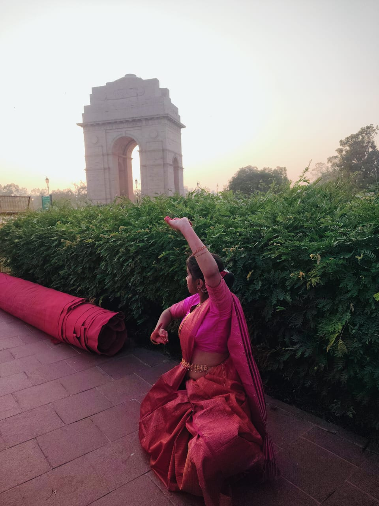

# Cultural Dance Portfolio Website - Complete Explanation

## Table of Contents
1. [HTML Structure](#html-structure)
2. [CSS Styling](#css-styling)
3. [JavaScript Functionality](#javascript-functionality)
4. [How Everything Works Together](#how-everything-works-together)

---

## HTML Structure

### 1. **Document Head** (Lines 1-14)
```html
<!DOCTYPE html>
<html lang="en">
<head>
    <meta charset="UTF-8">
    <meta name="viewport" content="width=device-width, initial-scale=1.0">
    <title>Cultural Dance Portfolio</title>
    <link href='...' rel='stylesheet'> <!-- Box Icons -->
    <link rel="stylesheet" href="style.css">
    <script src="script.js" defer></script>
</head>
```
**Why:**
- `DOCTYPE html` tells browser this is an HTML5 document
- `meta charset="UTF-8"` ensures special characters display correctly
- `meta viewport` makes the site responsive on mobile devices
- Box Icons link (`unpkg.com/boxicons`) loads icon library used throughout site
- `style.css` and `script.js` are linked here
- `defer` attribute means JavaScript loads after HTML is fully loaded

---

### 2. **GIF Loader** (Lines 18-21)
```html
<div id="gif-loader">
    
</div>
```
**Why:** Shows a full-screen loading animation when user first visits. JavaScript fades it out after 2 seconds (`window.addEventListener('load')`). Creates a polished first impression.

---

### 3. **Header/Navigation** (Lines 26-35)
```html
<header class="header">
    <a href="#" class="logo">Cultural Portfolio</a>
    <i class='bx bx-menu' id="menu-icon"></i> <!-- Hamburger menu icon -->
    <nav class="navbar">
        <a href="#home" class="nav-link active">Home</a>
        <a href="#about" class="nav-link">About</a>
        ...
    </nav>
</header>
```
**Why:**
- `#menu-icon` is a hamburger menu that only shows on mobile (CSS hides it on desktop)
- `.navbar` contains all navigation links that anchor to section IDs (`#home`, `#about`, etc.)
- JavaScript toggles `.active` class on nav links to show which section user is viewing
- On mobile, the menu icon toggles the navbar visibility

---

### 4. **Home Section** (Lines 39-66)
```html
<section class="home" id="home">
    <div class="home-content">
        <h3>Namaskaram, It's Me</h3>
        <h1>Ravi Threni</h1>
        <h3>And I'm a <span>Full Stack Developer</span></h3>
        <p>A passionate technologist...</p>
        <div class="social-media">
            <a href="https://github.com/...">...</a> <!-- Social links -->
        </div>
        <a href="images/dream RESUME1.pdf" target="_blank" class="btn">Download Resume</a>
    </div>
    <div class="home-img">
        
    </div>
</section>
```
**Why:**
- This is the hero/landing section users see first
- Contains name, brief intro, and call-to-action (Download Resume button)
- Social media links use `target="_blank"` to open in new tab
- Resume link points to `images/dream RESUME1.pdf` and opens in new tab
- Two-column layout: content on left, profile image on right

---

### 5. **About Section** (Lines 69-88)
```html
<section class="about" id="about">
    <div class="about-img">
        
    </div>
    <div class="about-content">
        <h2 class="heading">About <span>Me</span></h2>
        <h3>Frontend Developer & Classical Dance Artist</h3>
        <p>Born in Mahabubnagar, Telangana...</p>
        
        <div id="extra-text" style="display: none;">
            <p>Saket, where I excelled academically...</p>
        </div>
        
        <button class="btn read-more-btn">Read More</button>
    </div>
</section>
```
**Why:**
- `#extra-text` is hidden by default (`display: none`)
- When user clicks "Read More" button, JavaScript's `toggleReadMore()` function shows/hides this content
- Button text changes between "Read More" and "Read Less"
- Profile image is on left, text on right (mirror of Home section)

**JavaScript handling (Line 48 of script.js):**
```javascript
const readMoreBtn = document.querySelector('.read-more-btn');
if (readMoreBtn) readMoreBtn.addEventListener('click', toggleReadMore);
```
When button is clicked, `toggleReadMore()` shows the `#extra-text` div.

---

### 6. **Education Section** (Lines 91-115)
```html
<section class="education" id="education">
    <h2 class="heading">My <span>Education</span></h2>
    <div class="edu-container">
        <!-- Card 1 -->
        <div class="edu-card" data-file="https://igdtuw.in/IGDTUW/login">
            <h3>B.Tech (CSE)</h3>
            <p>2025 – 2029</p>
            <p>Currently pursuing Computer Science Engineering.</p>
        </div>
        
        <!-- Card 2 -->
        <div class="edu-card" data-file="images/marksheet_12.jpg">
            <h3>12th Standard</h3>
            ...
        </div>
        
        <!-- Card 3 -->
        <div class="edu-card" data-file="images/marksheet_10.jpg">
            <h3>10th Standard</h3>
            ...
        </div>
    </div>
</section>
```
**Why:**
- Three education cards displayed in a grid
- **`data-file` attribute:** Stores the file path or URL to open when card is clicked
  - Card 1: Opens college website URL in new tab
  - Card 2: Opens marksheet image in lightbox modal with zoom controls
  - Card 3: Opens marksheet image in lightbox modal with zoom controls

**JavaScript handling (Lines 51-55 of script.js):**
```javascript
document.querySelectorAll('.edu-card').forEach(card => {
    const target = card.dataset.file; // Get the data-file attribute
    if (target) {
        card.addEventListener('click', () => openLightbox(target));
    }
});
```
When any education card is clicked, `openLightbox(target)` is called with the file path/URL.

---

### 7. **Skills Section** (Lines 118-168)
```html
<section class="skills" id="skills">
    <h2 class="heading">My <span>Skills</span></h2>
    <div class="skills-container">
        <div class="skill-card">
            <h3>Python</h3>
            <div class="progress-bar">
                <div class="progress" style="width: 85%;"></div>
            </div>
            <p>85%</p>
        </div>
        <!-- More skill cards... -->
    </div>
</section>
```
**Why:**
- 6 skill cards in a grid layout
- Inline `width` CSS (e.g., `style="width: 85%"`) controls the progress bar fill percentage
- CSS animates the progress bar to fill smoothly

---

### 8. **Projects Section** (Lines 171-210)
```html
<section class="projects" id="projects">
    <h2 class="projects-main-heading">My <span>Projects</span></h2>
    <div class="projects-row">
        <div class="project-card">
            <h3>Quiz Game (C Language)</h3>
            <p>A technical quiz game created using C...</p>
            <a href="#" class="btn project-btn">View Project</a>
        </div>
        
        <!-- Project 3: SIH – ElementaPure -->
        <div class="project-card">
            <h3>SIH – ElementaPure</h3>
            <p>Eco-friendly purification system...</p>
            <a href="https://www.canva.com/design/DAGz3SUYWVM/..." 
               class="btn project-btn" 
               target="_blank" 
               rel="noopener noreferrer">View Project</a>
        </div>
        
        <!-- Project 4: KrishiSeva -->
        <div class="project-card">
            <h3>KrishiSeva</h3>
            <p>Machinery service provider platform...</p>
            <a href="https://www.canva.com/design/DAGz-vbNSXg/..." 
               class="btn project-btn" 
               target="_blank" 
               rel="noopener noreferrer">View Project</a>
        </div>
    </div>
</section>
```
**Why:**
- 4 project cards in a row
- Projects 1 & 2 have `href="#"` (placeholder links)
- Projects 3 & 4 have full Canva URLs and open in new tabs
- `target="_blank"` opens link in new browser tab
- `rel="noopener noreferrer"` is a security measure to prevent the new page from accessing your site

---

### 9. **Gallery Section** (Lines 213-275)
```html
<section class="gallery" id="gallery">
    <h2 class="heading">My <span>Gallery</span></h2>
    <div class="gallery-container">
        <!-- Card 1 -->
        <div class="gallery-card" data-video="images/VIDEO1.mp4" data-starttime="0" data-description="...">
            <div class="gallery-card-image">
                
                <i class='bx bx-play-circle'></i> <!-- Play button icon -->
            </div>
        </div>
        <!-- 5 more cards... -->
    </div>
</section>
```
**Why:**
- 6 video cards displayed in a grid
- **`data-video`:** Path to the MP4 video file
- **`data-starttime`:** Timestamp in seconds where video should start (e.g., Card 5 starts at 224 seconds = 3:44)
- **`data-description`:** Text description (stored but not shown per user request)
- Each card shows a thumbnail image with a centered play icon overlay
- When card is clicked, `openVideoModal()` plays the video in a full-screen modal

**JavaScript handling (Lines 82-90 of script.js):**
```javascript
document.querySelectorAll('.gallery-card').forEach(card => {
    const videoUrl = card.dataset.video;
    if (videoUrl) {
        card.addEventListener('click', () => {
            const startTime = card.dataset.starttime ? parseInt(card.dataset.starttime) : 0;
            openVideoModal(videoUrl, startTime);
        });
    }
});
```

---

### 10. **Contact Section** (Lines 278-312)
```html
<section class="contact" id="contact">
    <h2 class="contact-heading">Contact <span>Me</span></h2>
    <div class="contact-container">
        <!-- LEFT: Get In Touch Info -->
        <div class="contact-info-card">
            <h3>Get In Touch</h3>
            <p>Email: ravithreni02@gmail.com</p>
            <p>Phone: +91 98662 70907</p>
        </div>
        
        <!-- RIGHT: Contact Form -->
        <form class="contact-form">
            <input type="text" placeholder="Full Name" required>
            <input type="email" placeholder="Email Address" required>
            <input type="text" placeholder="Subject" required>
            <textarea placeholder="Your Message" required></textarea>
            <button type="submit" class="btn contact-btn">Send Message</button>
        </form>
    </div>
</section>
```
**Why:**
- Two-column layout: contact info on left, form on right
- Form has `required` attributes (browser won't submit if fields are empty)
- When form is submitted, `showSuccessPopup()` displays a success message

**JavaScript handling (Line 50 of script.js):**
```javascript
const contactForm = document.querySelector('.contact-form');
if (contactForm) contactForm.addEventListener('submit', showSuccessPopup);
```

---

### 11. **Modals** (Lines 315-343)

#### Success Popup (Lines 315-320)
```html
<div class="success-popup" id="successPopup">
    <div class="popup-content">
        <div class="checkmark">✔</div>
        <p>Message Sent Successfully!</p>
    </div>        
</div>
```
**Why:** Shows when contact form is submitted. JavaScript displays it for 2 seconds, then hides it.

#### Video Modal (Lines 322-329)
```html
<div class="video-modal" id="videoModal">
    <span class="close-video">&times;</span>
    <div class="video-player">
        <iframe id="video-iframe" src=""></iframe> <!-- For YouTube embeds -->
        <video id="video-mp4" controls></video>     <!-- For local MP4 files -->
    </div>
</div>
```
**Why:**
- `#video-iframe` plays YouTube videos (embedded)
- `#video-mp4` plays local MP4 files with native browser controls
- `&times;` is the close (×) button
- Only one player shows at a time (the other has `display: none`)

#### Lightbox Modal (Lines 331-343)
```html
<div class="lightbox" id="lightbox">
    <span class="close-lightbox">&times;</span>
    <div class="lightbox-controls">
        <button class="zoom-btn zoom-out" id="zoom-out">−</button>
        <span class="zoom-level" id="zoom-level">100%</span>
        <button class="zoom-btn zoom-in" id="zoom-in">+</button>
    </div>
    <div class="lightbox-content">
        
        <iframe id="lightbox-pdf" src=""></iframe>
    </div>
</div>
```
**Why:**
- Shows images or PDFs in a modal overlay
- Zoom controls let users zoom in/out (1-300%)
- `#lightbox-img` shows images
- `#lightbox-pdf` shows PDFs
- Close button and outside click both close the modal

---

## CSS Styling

### 1. **Root Theme Variables** (style.css Lines 14-19)
```css
:root {
    --bg-color: #3b1f1f;              /* Dark brown background */
    --second-bg-color: #4a2626;       /* Slightly lighter brown */
    --text-color: #fff;               /* White text */
    --gold: #e0b45c;                  /* Gold color for accents */
    --highlight: #ffdd8a;             /* Light yellow highlight */
}
```
**Why:** CSS variables make it easy to change colors everywhere at once. All gold accents use `var(--gold)`.

---

### 2. **Global Styles**
```css
* {
    margin: 0;
    padding: 0;
    box-sizing: border-box;
    scroll-behavior: smooth;
}

html {
    font-size: 62.5%;  /* Makes 1rem = 10px for easier calculations */
    overflow-x: hidden;
}
```
**Why:**
- `box-sizing: border-box` makes width/padding calculations easier
- `scroll-behavior: smooth` makes anchor links scroll smoothly
- Base font size of 62.5% makes responsive design easier

---

### 3. **Background Image**
```css
body, section, .home, .about {
    background-image: url("https://static.vecteezy.com/...");
    background-size: cover;
    background-position: center;
    background-repeat: no-repeat;
    background-attachment: fixed;
}
```
**Why:** 
- `background-attachment: fixed` creates a parallax effect as user scrolls
- Covers entire viewport
- Shows a dance silhouette as background

---

### 4. **Header/Navigation Styles**
```css
.header {
    position: fixed;
    top: 0;
    left: 0;
    width: 100%;
    z-index: 1000;
    backdrop-filter: blur(8px);
}

#menu-icon {
    display: none;  /* Hidden by default */
}

@media screen and (max-width: 768px) {
    #menu-icon { display: block; }           /* Show on mobile */
    .navbar { display: none; }               /* Hide navbar on mobile */
    .navbar.active { display: flex; }        /* Show when .active class added */
}
```
**Why:**
- `position: fixed` keeps header at top while scrolling
- `z-index: 1000` keeps it above other content
- `backdrop-filter: blur(8px)` creates glass-morphism effect
- Media query at 768px breakpoint: hamburger menu hidden on desktop, shown on mobile
- JavaScript toggles `.active` class to show/hide mobile menu

---

### 5. **Gallery Grid Layout**
```css
.gallery-container {
    display: grid;
    grid-template-columns: repeat(6, 1fr);  /* 6 equal columns */
    gap: 4.5rem;
}
```
**Why:** Creates 6 video cards in one row on desktop. Responsive breakpoints would stack them on mobile (not shown in excerpt).

---

### 6. **Gallery Cards and Play Icon**
```css
.gallery-card-image {
    position: relative;
    width: 100%;
    height: 200px;
}

.gallery-card-image i {
    position: absolute;
    z-index: 2;
    left: 50%;
    top: 50%;
    transform: translate(-50%, -50%);  /* Centers the icon */
}

.gallery-card-image img {
    z-index: 1;
}
```
**Why:**
- `position: relative` on container lets child icon use `position: absolute`
- `z-index: 2` on play icon puts it above the image (`z-index: 1`)
- `transform: translate(-50%, -50%)` centers the icon perfectly
- Thumbnail image sits below play icon

---

### 7. **Lightbox Modal Styles**
```css
.lightbox {
    position: fixed;
    inset: 0;  /* Top, right, bottom, left all 0 - fills entire screen */
    display: none;
    background: rgba(0, 0, 0, 0.8);  /* Semi-transparent black overlay */
    z-index: 9998;
}

.zoom-btn {
    background: var(--gold);
    color: #3b1f1f;
    padding: 0.8rem 1.4rem;
    border-radius: 50%;  /* Circular buttons */
    cursor: pointer;
}
```
**Why:**
- `inset: 0` is shorthand for positioning all 4 sides to 0
- `display: none` by default, JavaScript sets to `flex` when needed
- Zoom buttons are circular with gold background

---

### 8. **Video Modal Styles**
```css
.video-modal {
    position: fixed;
    inset: 0;
    display: none;
    background: rgba(0, 0, 0, 0.9);
    z-index: 9997;
}

.video-player {
    width: 90%;
    max-width: 900px;
    aspect-ratio: 16 / 9;  /* Maintains 16:9 ratio automatically */
    border: 8px solid var(--gold);
}
```
**Why:**
- `aspect-ratio: 16 / 9` maintains video proportions responsively
- Golden border creates premium look
- High z-index ensures it appears above everything

---

### 9. **Golden Glow Effects**
Throughout the CSS, you'll see:
```css
box-shadow:
    0 0 25px rgba(255, 200, 80, 0.85),
    0 0 45px rgba(255, 180, 60, 0.75),
    0 0 70px rgba(255, 160, 40, 0.55),
    0 0 110px rgba(255, 150, 30, 0.35);
```
**Why:** Multiple layered shadows create a glowing effect around cards and elements. Gives a premium, luxurious feel.

---

## JavaScript Functionality

### 1. **`toggleReadMore()` Function** (Lines 1-12)
```javascript
function toggleReadMore(event) {
    const extraText = document.getElementById('extra-text');
    const btn = event.currentTarget || event.target;
    if (!extraText) return;
    
    if (extraText.style.display === 'none' || extraText.style.display === '') {
        extraText.style.display = 'block';
        btn.textContent = 'Read Less';
    } else {
        extraText.style.display = 'none';
        btn.textContent = 'Read More';
    }
}
```
**What it does:**
1. Gets the hidden text element (`#extra-text`)
2. Gets the button that triggered the click
3. If text is hidden, show it and change button to "Read Less"
4. If text is visible, hide it and change button to "Read More"

**Usage:** Called when "Read More" button in About section is clicked.

---

### 2. **`showSuccessPopup()` Function** (Lines 14-21)
```javascript
function showSuccessPopup(event) {
    event.preventDefault();  // Stops form from actually submitting
    const popup = document.getElementById('successPopup');
    if (!popup) return;
    
    popup.style.display = 'flex';
    
    setTimeout(() => { 
        popup.style.display = 'none'; 
    }, 2000);  // Hide after 2 seconds
}
```
**What it does:**
1. Prevents form default submission behavior
2. Shows the success popup message
3. Automatically hides it after 2 seconds (2000 milliseconds)

**Usage:** Called when contact form is submitted.

---

### 3. **DOMContentLoaded Event Listener** (Lines 25-111)
```javascript
document.addEventListener('DOMContentLoaded', () => {
    // All initialization code runs here
});
```
**Why:** Ensures all HTML elements are loaded before JavaScript tries to access them. Prevents errors from trying to find elements that don't exist yet.

---

### 4. **Mobile Menu Toggle** (Lines 27-32)
```javascript
const menuIcon = document.querySelector('#menu-icon');
const navbar = document.querySelector('.navbar');

if (menuIcon && navbar) {
    menuIcon.addEventListener('click', () => 
        navbar.classList.toggle('active')
    );
}
```
**What it does:**
1. Gets the hamburger menu icon and navbar
2. When hamburger is clicked, toggles the `.active` class on navbar
3. CSS shows/hides navbar based on `.active` class

**Usage:** Mobile menu open/close functionality.

---

### 5. **Nav Link Active State** (Lines 34-41)
```javascript
document.querySelectorAll('.nav-link').forEach(link => {
    link.addEventListener('click', function () {
        document.querySelectorAll('.nav-link').forEach(a => 
            a.classList.remove('active')
        );
        this.classList.add('active');
        
        if (navbar && navbar.classList.contains('active')) 
            navbar.classList.remove('active');  // Close mobile menu
    });
});
```
**What it does:**
1. When any nav link is clicked, remove `.active` from all links
2. Add `.active` to the clicked link (highlights it)
3. If mobile menu is open, close it

**Usage:** Shows user which section they're viewing.

---

### 6. **Education Card Click Handler** (Lines 51-55)
```javascript
document.querySelectorAll('.edu-card').forEach(card => {
    const target = card.dataset.file;
    if (target) {
        card.style.cursor = 'pointer';
        card.addEventListener('click', () => openLightbox(target));
    }
});
```
**What it does:**
1. For each education card, get its `data-file` attribute
2. Set cursor to pointer (clickable style)
3. When clicked, call `openLightbox()` with the file path

**Usage:** Opens marksheets and links when education cards are clicked.

---

### 7. **`openLightbox()` Function** (Lines 129-157)
```javascript
function openLightbox(filePath) {
    // Check if it's a URL (http/https)
    if (filePath.startsWith('http://') || filePath.startsWith('https://')) {
        window.open(filePath, '_blank');
        return;
    }

    const lightbox = document.getElementById('lightbox');
    const img = document.getElementById('lightbox-img');
    const pdf = document.getElementById('lightbox-pdf');

    currentZoom = 100;
    updateZoomDisplay();

    // Check if file is PDF or image
    if (filePath.toLowerCase().endsWith('.pdf')) {
        img.style.display = 'none';
        pdf.style.display = 'block';
        pdf.src = filePath;
    } else {
        pdf.style.display = 'none';
        img.style.display = 'block';
        img.src = filePath;
        img.style.transform = 'scale(1)';
    }

    lightbox.style.display = 'flex';
}
```
**What it does:**
1. If it's a URL, open it in a new tab
2. If it's a local file:
   - Check if PDF or image
   - Hide one player, show the other
   - Set the file path
   - Reset zoom to 100%
   - Show the lightbox modal

**Usage:** Displays marksheets and PDFs in a modal with zoom controls.

---

### 8. **Zoom Functions** (Lines 159-184)
```javascript
function zoomIn() {
    const img = document.getElementById('lightbox-img');
    if (img && img.style.display !== 'none') {
        currentZoom = Math.min(currentZoom + 10, 300);  // Max 300%
        img.style.transform = `scale(${currentZoom / 100})`;
        updateZoomDisplay();
    }
}

function zoomOut() {
    const img = document.getElementById('lightbox-img');
    if (img && img.style.display !== 'none') {
        currentZoom = Math.max(currentZoom - 10, 50);   // Min 50%
        img.style.transform = `scale(${currentZoom / 100})`;
        updateZoomDisplay();
    }
}

function updateZoomDisplay() {
    const zoomLevel = document.getElementById('zoom-level');
    if (zoomLevel) zoomLevel.textContent = `${currentZoom}%`;
}
```
**What it does:**
- `zoomIn()`: Increases zoom by 10% (max 300%)
- `zoomOut()`: Decreases zoom by 10% (min 50%)
- `updateZoomDisplay()`: Updates the "100%" text to show current zoom level
- Uses CSS `scale()` to zoom the image

**Usage:** User clicks +/− buttons to zoom in/out of marksheets.

---

### 9. **Gallery Card Click Handler** (Lines 82-90)
```javascript
document.querySelectorAll('.gallery-card').forEach(card => {
    const videoUrl = card.dataset.video;
    if (videoUrl) {
        card.addEventListener('click', () => {
            const startTime = card.dataset.starttime ? 
                parseInt(card.dataset.starttime) : 0;
            openVideoModal(videoUrl, startTime);
        });
    }
});
```
**What it does:**
1. For each gallery card, get the `data-video` URL
2. Get the `data-starttime` (when to start playing)
3. When clicked, open the video modal at that start time

**Usage:** Plays videos when gallery cards are clicked.

---

### 10. **`openVideoModal()` Function** (Lines 186-207)
```javascript
function openVideoModal(videoUrl, startTime = 0) {
    const modal = document.getElementById('videoModal');
    const iframe = document.getElementById('video-iframe');
    const video = document.getElementById('video-mp4');
    
    if (!modal || !iframe || !video) return;
    
    // Hide both players first and clear sources
    iframe.style.display = 'none';
    video.style.display = 'none';
    iframe.src = '';
    video.src = '';
    
    if (videoUrl.endsWith('.mp4')) {
        video.src = videoUrl;
        video.style.display = 'block';
        video.load();
        try { video.currentTime = startTime; } catch (e) {}
        video.play();
    } else {
        iframe.src = videoUrl;
        iframe.style.display = 'block';
    }

    modal.style.display = 'flex';
}
```
**What it does:**
1. Gets both video player types (HTML5 and iframe)
2. Hides and clears both to start fresh
3. If MP4 file:
   - Sets the source
   - Seeks to start time
   - Starts playing
4. If not MP4 (YouTube URL):
   - Sets the iframe src
   - Shows iframe
5. Displays the video modal

**Usage:** Plays videos when gallery cards are clicked. Supports both local MP4 and YouTube embeds.

---

### 11. **Modal Close Handlers** (Lines 92-111)
```javascript
// Close video modal on X click
const closeVideoBtn = document.querySelector('.close-video');
if (closeVideoBtn) {
    closeVideoBtn.addEventListener('click', () => {
        const modal = document.getElementById('videoModal');
        const iframe = document.getElementById('video-iframe');
        const video = document.getElementById('video-mp4');
        
        if (video) { 
            try { video.pause(); } catch(e){}
            video.currentTime = 0; 
            video.src = ''; 
        }
        if (iframe) { iframe.src = ''; }
        if (modal) modal.style.display = 'none';
    });
}

// Close video modal on outside click
const videoModal = document.getElementById('videoModal');
if (videoModal) {
    videoModal.addEventListener('click', (e) => {
        if (e.target === videoModal) {  // Only close if clicking background
            // Same cleanup code...
        }
    });
}
```
**What it does:**
1. When X button is clicked or background is clicked:
   - Pauses the video
   - Resets playback position to 0
   - Clears video source
   - Hides the modal
2. Prevents video from playing in background after closing

**Usage:** Cleanup when user closes video modal.

---

### 12. **Loader Fade Out** (Lines 209-217)
```javascript
window.addEventListener('load', () => {
    const loader = document.getElementById('gif-loader');
    if (!loader) return;
    
    setTimeout(() => {
        loader.style.opacity = '0';
        loader.style.pointerEvents = 'none';
    }, 2000);  // After 2 seconds
});
```
**What it does:**
1. Waits for entire page to load (all images, etc.)
2. Waits 2 more seconds
3. Fades out the loader GIF
4. Sets `pointerEvents: none` so it doesn't block clicks

**Usage:** Creates a professional loading experience on first visit.

---

## How Everything Works Together

### **User Flow: Viewing a Video**

1. **User lands on page** → Loader GIF shows for 2 seconds, then fades
2. **User scrolls to Gallery** → Sees 6 video card thumbnails with play icons
3. **User clicks a video card** →
   - `gallery-card` click handler triggers
   - Gets `data-video` URL and `data-starttime`
   - Calls `openVideoModal(videoUrl, startTime)`
   - Video modal appears with video playing at that timestamp
4. **User watches video** → HTML5 video controls allow pause/play/seek
5. **User clicks X or outside modal** →
   - Close handler pauses video, clears source
   - Modal disappears
   - Video stops playing in background

---

### **User Flow: Viewing a Marksheet**

1. **User clicks Education Card** →
   - Gets `data-file` attribute (path to image)
   - Calls `openLightbox(filePath)`
2. **Lightbox opens** →
   - Loads image from file path
   - Shows zoom controls above it
   - Sets zoom to 100%
3. **User clicks zoom buttons** →
   - Zoom increases/decreases by 10%
   - Image scales using CSS `scale()`
   - Percentage display updates
4. **User clicks X or background** →
   - Modal closes
   - Zoom resets to 100%

---

### **User Flow: Read More**

1. **User sees About section** → Extra bio text is hidden (`display: none`)
2. **User clicks "Read More"** →
   - `toggleReadMore()` function runs
   - Shows `#extra-text` div
   - Button changes to "Read Less"
3. **User clicks "Read Less"** →
   - Hides `#extra-text` div
   - Button changes back to "Read More"

---

### **User Flow: Mobile Navigation**

**Desktop:** All nav links visible horizontally
**Mobile (under 768px):**
1. Hamburger menu icon appears
2. Navbar is hidden
3. User clicks hamburger →
   - `.active` class toggles on navbar
   - CSS shows it as a vertical dropdown
4. User clicks a nav link →
   - Link gets `.active` class (highlighted)
   - Navbar closes automatically
   - Smooth scroll to that section (from `scroll-behavior: smooth`)

---

## Summary Table

| Component | HTML | CSS | JavaScript |
|-----------|------|-----|-----------|
| **Header/Nav** | Navigation links with anchors | Fixed position, responsive menu | Toggle mobile menu, track active link |
| **Home** | Profile pic, intro text | Flexbox layout, golden text | None (static) |
| **About** | Profile pic, bio, Read More button | Flexbox layout | Toggle hidden text on button click |
| **Education** | 3 cards with `data-file` attributes | Grid layout, golden borders | Open lightbox on click |
| **Skills** | 6 cards with progress bars | Grid layout, animated bars | None (static) |
| **Projects** | 4 cards with links | Flexbox row layout | None (links open externally) |
| **Gallery** | 6 cards with `data-video` and thumbnails | Grid layout, play icon overlay | Open video modal on click |
| **Contact** | Form + contact info | Two-column layout | Submit form, show success popup |
| **Lightbox Modal** | Image + PDF players, zoom buttons | Centered overlay, zoom controls | Show/hide, zoom in/out |
| **Video Modal** | HTML5 video + iframe players | Centered overlay, 16:9 aspect | Show/hide, load video, play at timestamp |
| **Loader** | Full-screen GIF | Overlay with fade | Fade out after 2 seconds |

---

## Key Concepts Explained

### **`data-*` Attributes**
- Custom HTML attributes that store data
- Accessed in JavaScript via `element.dataset.propertyName`
- Used for education files, video URLs, start times, etc.

### **Event Listeners**
- `addEventListener()` attaches functions to HTML events
- Events: `click`, `submit`, `load`, `DOMContentLoaded`, etc.
- Example: `button.addEventListener('click', function() { ... })`

### **CSS Grid**
- `display: grid` creates flexible grid layouts
- `grid-template-columns: repeat(6, 1fr)` creates 6 equal columns
- Cards automatically arrange in rows

### **Modal Pattern**
- Hidden div (`display: none`) shown on demand (`display: flex`)
- Background overlay (`position: fixed; inset: 0`)
- Click outside to close (check if `e.target === modal`)

### **Responsive Design**
- Media queries (`@media screen and (max-width: 768px)`)
- Hide/show elements based on screen size
- Flex layouts adapt automatically

---

This document covers all major functionality of your portfolio website. Each section demonstrates web development best practices for HTML structure, CSS styling, and JavaScript interactivity!
